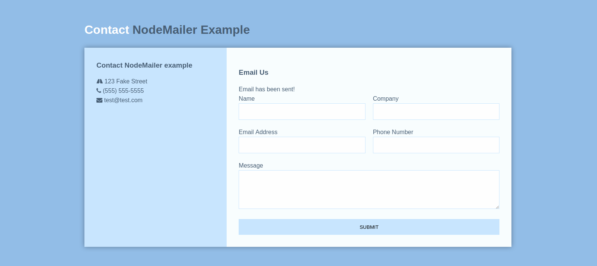

# Contact Form with NodeMailer

## Some screen prints

### Empty form

### Filling the form

### Response from server

### Message sent successfully

## Start the app

In the project directory, you can run:

### `npm start`

To execute with Nodemon:

### `npm run dev`

Runs the app in the development mode. 
Open [http://localhost:5001](http://localhost:5001) to view it in the browser.

The page will reload if you make edits. 
You will also see any lint errors in the console.